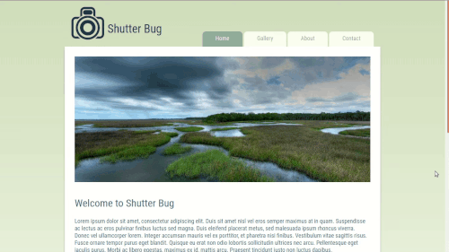

# Shutter Bug Photography Blog #

This is a demonstration of my HTML &amp; CSS skills, particularly at converting a design file into usable HTML &amp; CSS.

  

## Installation ##

1. Clone this repository (`git clone https://github.com/johnisom/shutter-bug`)
2. `cd` into the repository (`cd shutter-bug`)
3. Open `index.html` in your favorite browser
4. Enjoy looking at the static site
